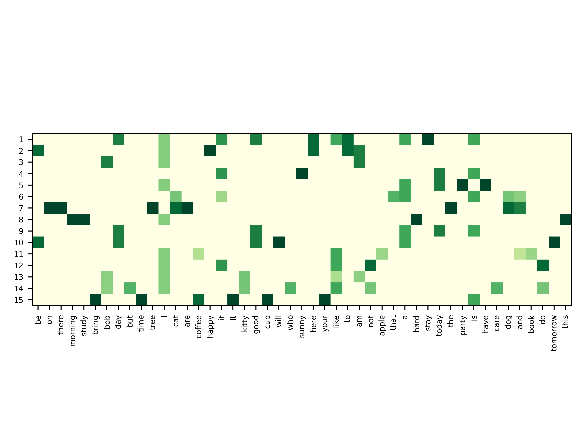
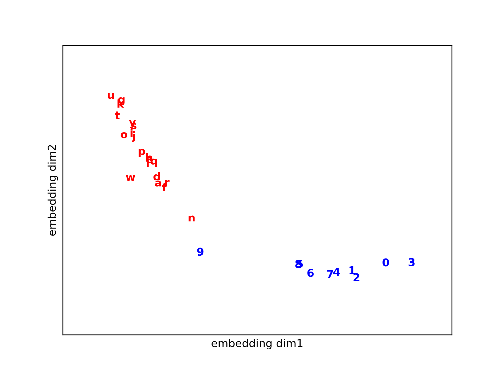
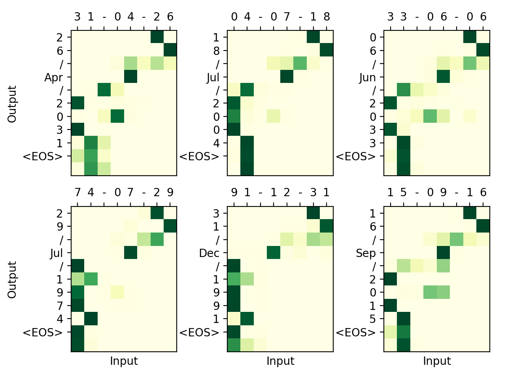
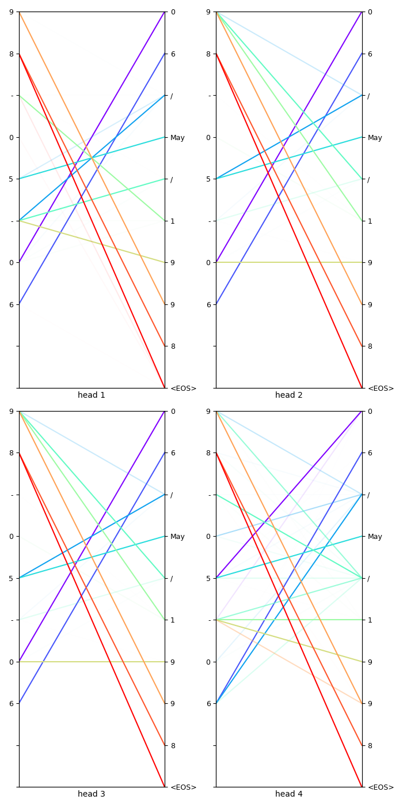
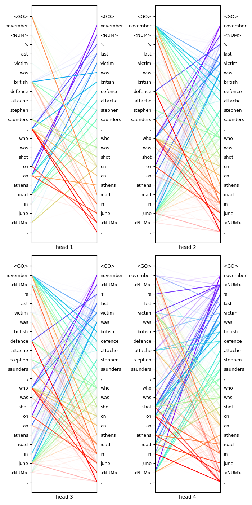

# Natural Language Processing Tutorial

Tutorial in Chinese can be found in [mofanpy.com](https://mofanpy.com/tutorials/machine-learning/nlp).

This repo includes many simple implementations of models in Neural Language Processing (NLP).

All code implementations in this tutorial are organized as following:

1. Search Engine
  - [TF-IDF numpy / TF-IDF skearn](#TF-IDF)
2. Understand Word (W2V)
  - [Continuous Bag of Words (CBOW)](#Word2Vec)
  - [Skip-Gram](#Word2Vec)
3. Understand Sentence (Seq2Seq)
  - [seq2seq](#Seq2Seq)
  - [CNN language model](#CNNLanguageModel)
4. All about Attention
  - [seq2seq with attention](#Seq2SeqAttention)
  - [Transformer](#Transformer)
5. Pretrained Models
  - [ELMo](#ELMO)
  - [GPT](#GPT)
  - [BERT](#BERT)
 
## TF-IDF

TF-IDF numpy [code](tf_idf.py)

TF-IDF short sklearn [code](tf_idf_sklearn.py)

## Word2Vec
[Efficient Estimation of Word Representations in Vector Space](https://arxiv.org/pdf/1301.3781.pdf)

Skip-Gram [code](skip-gram.py)

CBOW [code](CBOW.py)

## Seq2Seq
[Sequence to Sequence Learning with Neural Networks](https://papers.nips.cc/paper/5346-sequence-to-sequence-learning-with-neural-networks.pdf)

Seq2Seq [code](seq2seq.py)

## CNNLanguageModel
[Convolutional Neural Networks for Sentence Classification](https://arxiv.org/pdf/1408.5882.pdf)

CNN language model [code](cnn-lm.py)

## Seq2SeqAttention
[Effective Approaches to Attention-based Neural Machine Translation](https://arxiv.org/pdf/1508.04025.pdf)

Seq2Seq Attention [code](seq2seq_attention.py)

## Transformer
[Attention Is All You Need](https://arxiv.org/pdf/1706.03762.pdf)

Transformer [code](transformer.py)

## ELMO
[Deep contextualized word representations](https://arxiv.org/pdf/1802.05365.pdf)

ELMO [code](ELMo.py)

## GPT
[Improving Language Understanding by Generative Pre-Training](https://cdn.openai.com/research-covers/language-unsupervised/language_understanding_paper.pdf)

GPT [code](GPT.py)

## BERT
[BERT: Pre-training of Deep Bidirectional Transformers for Language Understanding](https://arxiv.org/pdf/1810.04805.pdf)

BERT [code](BERT.py)

My new attempt [Bert with window mask](BERT_window_mask.py)

