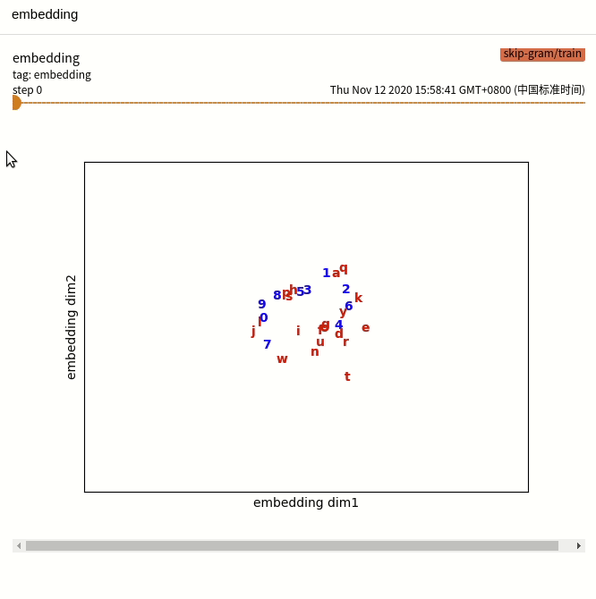
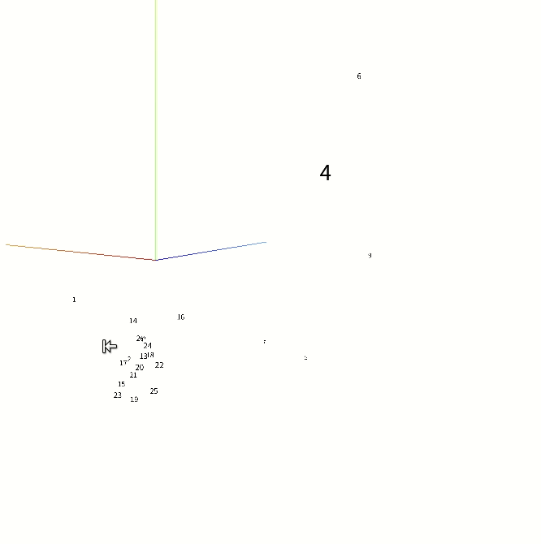
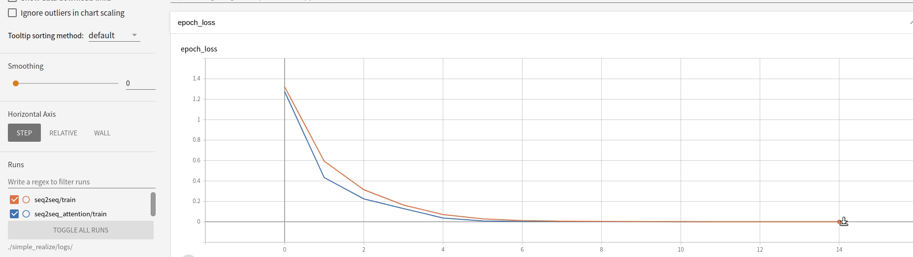

# NLP教程简化实现

>这个目录下是NLP课程代码使用纯keras完成的简化版本，而且全部实现了tensorboard可视化

在这些简化后的代码中，你可以
* 直观地了解seq2seq实现细节
* 直观地了解LuongAttention实现细节
* 看到embedding动画
* 比较带有attention的seq2seq和普通seq2seq
* 更进一步扩展模型

-----

## 代码
1. Understand Word (W2V)
  - [Continuous Bag of Words (CBOW)](#Word2Vec)
  - [Skip-Gram](#Word2Vec)
2. Understand Sentence (Seq2Seq)
  - [seq2seq](#Seq2Seq)
  - [CNN language model](#CNNLanguageModel)
3. All about Attention
  - [seq2seq with attention](#Seq2SeqAttention)
  
##Word2Vec
* [CBOW](CBOW.py)
* [Skip-Gram](skip-gram.py)

##Seq2Seq
* [seq2seq](seq2seq.py)
* [cnn-im](cnn-lm.py)

##Seq2SeqAttention
* [seq2seq_attention](seq2seq_attention.py)
